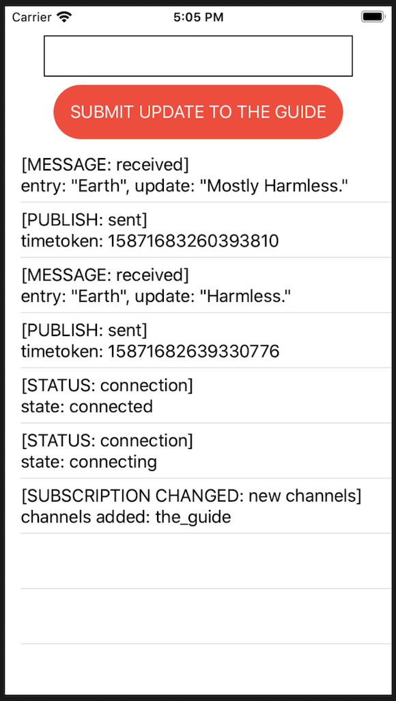

# PubNub Swift Sample App

This repository contains the files required to run the [PubNub Swift Quickstart](https://www.pubnub.com/docs/platform/quickstarts/swift).

PubNub takes care of the infrastructure and APIs needed for the realtime communication layer of your application. Work on your app's logic and let PubNub handle sending and receiving data across the world in less than 100ms.

## Get keys

You will need the publish and subscribe keys to authenticate your app. Get your keys from the [Admin Portal](https://dashboard.pubnub.com/login).

## Setup the project

If you don't want to copy the code from this document, you can clone the repository and use the files in there.


1. Open Xcode and create a new iOS App.
2. Give it a Product Name, `pnquickstart`.
3. Set the Language to Swift.
4. Set User Interface to SwiftUI.
5. Set Lifecycle to UIKitAppDelegate.
6. Save the project to your file system.
7. Navigate to File > Swift Packages > Add Package Dependency, enter the package repository URL: https://github.com/pubnub/swift.git and click the dialog's Next and Finish buttons, keeping all default options.

## Add project files

If you don't want to copy the code from this document, you can clone the repository and use the files in there.

1. Open the `SceneDelegate.swift` and replace `let contentView = ContentView()` with the following code. Remember to also replace the myPublishKey and mySubscribeKey placeholders with your keys.

   ```swift
   let contentView = ContentView(pubnubStore: PubNubStore())
   ```

2. Open the `ContentView.swift` file. Overwrite all existing code with the following code:
   
    ```swift
    import SwiftUI
    import PubNub

    struct ContentView: View {

    @ObservedObject var pubnubStore: PubNubStore
    @State var entry = "Mostly Harmless."

    var body: some View {
        VStack {
        Spacer()

        TextField("", text: $entry, onCommit: submitUpdate)
            .textFieldStyle(RoundedBorderTextFieldStyle())
            .frame(width: 300.0, height: 40)

        Spacer()

        Button(action: submitUpdate) {
            Text("SUBMIT UPDATE TO THE GUIDE")
            .padding()
            .foregroundColor(Color.white)
            .background(entry.isEmpty ? Color.secondary : Color.red)
            .cornerRadius(40)
        }
        .disabled(entry.isEmpty)
        .frame(width: 300.0)

        Spacer()

        List {
            ForEach(pubnubStore.messages.reversed()) { message in
            VStack(alignment: .leading) {
                Text(message.messageType)
                Text(message.messageText)
            }
            }
        }

        Spacer()
        }
    }

    func submitUpdate() {
        if !self.entry.isEmpty {
        pubnubStore.publish(update: EntryUpdate(update: self.entry))
        self.entry = ""
        }

        // Hides keyboard
        UIApplication.shared.sendAction(#selector(UIResponder.resignFirstResponder), to: nil, from: nil, for: nil)
    }
    }

    // MARK:- View Stores
    class PubNubStore: ObservableObject {
    @Published var messages: [Message] = []

    var pubnub: PubNub
    let channel: String = "the_guide"
    let clientUUID: String = UUID().uuidString

    init() {
        var pnconfig = PubNubConfiguration(publishKey: "myPublishKey", subscribeKey: "mySubscribeKey")
        pnconfig.uuid = clientUUID

        self.pubnub = PubNub(configuration: pnconfig)

        startListening()
        subscribe(to: self.channel)
    }

    lazy var listener: SubscriptionListener? = {
        let listener = SubscriptionListener()

        listener.didReceiveMessage = { [weak self] event in
        if let entry = try? event.payload.codableValue.decode(EntryUpdate.self) {

            self?.display(
            Message(messageType: "[MESSAGE: received]", messageText: "entry: \(entry.entry), update: \(entry.update)")
            )
        }
        }

        listener.didReceivePresence = { [weak self] event in
        let userChannelDescription = "event uuid: \(event.metadata?.codableValue["pn_uuid"] ?? "null"), channel: \(event.channel)"

        self?.display(
            Message(messageType: "[PRESENCE: \(event.metadata?.codableValue["pn_action"] ?? "null")]", messageText: userChannelDescription)
        )
        }

        listener.didReceiveSubscriptionChange = { [weak self] event in
        switch event {
        case .subscribed(let channels, _):
            self?.display(Message(messageType: "[SUBSCRIPTION CHANGED: new channels]", messageText: "channels added: \(channels[0].id)"))
            self?.publish(update: EntryUpdate(update: "Harmless."))
        default: break
        }
        }

        listener.didReceiveStatus = { [weak self] event in
        switch event {
        case .success(let connection):
            self?.display(Message(messageType: "[STATUS: connection]", messageText: "state: \(connection)"))
        case .failure(let error):
            print("Status Error: \(error.localizedDescription)")
        }
        }

        return listener
    }()

    func startListening() {
        if let listener = listener {
        pubnub.add(listener)
        }
    }

    func subscribe(to channel: String) {
        pubnub.subscribe(to: [channel], withPresence: true)
    }

    func display(_ message: Message) {
        self.messages.append(message)
    }

    func publish(update entryUpdate: EntryUpdate) {
        pubnub.publish(channel: self.channel, message: entryUpdate) { [weak self] result in
        switch result {
        case let .success(timetoken):
            self?.display(
            Message(messageType: "[PUBLISH: sent]", messageText: "timetoken: \(timetoken.formattedDescription) (\(timetoken.description))")
            )

        case let .failure(error):
            print("failed: \(error.localizedDescription)")
        }
        }
    }
    }

    // MARK:- Models

    struct EntryUpdate: JSONCodable {
    var update: String
    var entry: String

    init(update: String, entry: String = "Earth") {
        self.update = update
        self.entry = entry
    }
    }

    struct Message: Identifiable {
    var id = UUID()
    var messageType: String
    var messageText: String
    }

    // MARK:- Extension Helpers
    extension DateFormatter {
    static let defaultTimetoken: DateFormatter = {
        var formatter = DateFormatter()
        formatter.timeStyle = .medium
        formatter.dateStyle = .short
        formatter.locale = Locale(identifier: "en_US_POSIX")
        return formatter
    }()
    }

    extension Timetoken {
    var formattedDescription: String {
        return DateFormatter.defaultTimetoken.string(from: timetokenDate)
    }
    }

    // MARK:- View Preview
    struct ContentView_Previews: PreviewProvider {
    static let store = PubNubStore()

    static var previews: some View {
        ContentView(pubnubStore: store)
    }
    }
    ```

## Run the app

1. Open the `index.html` file in a browser.

    You should see the iPhone simulator that displays a screen similar to this:

    

    A message was published on app start up and some other events were displayed.

2. Submit a new entry.

    A new entry update is auto populated for you: "Mostly Harmless." Change the text then click the Submit Update to the Guide button to publish the new update. The new update appears at the top of the current messages, while the older messages scroll down, and the entry update field is cleared for you to enter something new.

    > This code is executed asynchronously, so the order in which the [MESSAGE: received] and [PUBLISH: sent] messages appear may vary.

## Documentation

* [Build your first realtime Swift app with PubNub](https://www.pubnub.com/docs/platform/quickstarts/swift)
* [API reference for Swift](https://www.pubnub.com/docs/swift-native/pubnub-swift-sdk)

## Support

If you **need help** or have a **general question**, contact support@pubnub.com.
